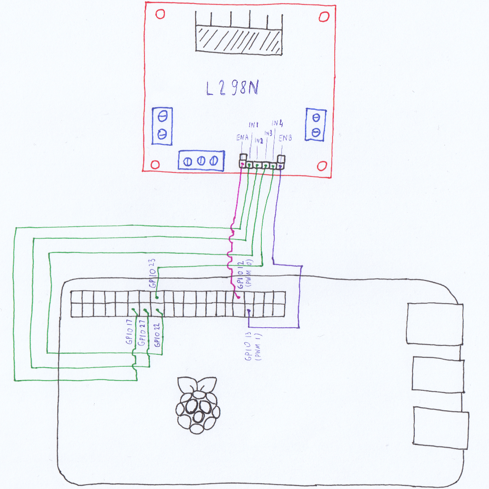

# Remote Robot Control

Remote Robot Control is as set of Python modules for DC motor control, 
connected to robot, remotely via PC over LAN.
The robot DC motors are connected to L298N dual DC motor driver (H-bridge), 
which is connected to GPIO pins on RaspberryPi.
Remote robot control is achieved by using TCP sockets over local (home) 
network.
In the following text it will be explained how to setup this Python scripts 
to work with robot (DC motors, L298N and RaspberryPi) and PC.


## Robot hardware setup

Minimum parts required for this project to successfully work are listed here:
1. [Gearbox DC motor with gear ratio 1:48](https://soldered.com/product/yellow-wheel-and-motor-for-robotic-projects) (2x)
2. [L298N dual DC motor driver](https://soldered.com/product/dc-motor-driver-dual-h-bridge-l298n)
3. [RaspberryPi](https://soldered.com/hr/proizvod/raspberry-pi-4-b-2gb)
4. [Power supply for RaspberryPi](https://soldered.com/product/power-supply-5v-3a-with-microusb-connector)
5. [Set of male-female cables](https://soldered.com/product/set-of-male-female-cables-40-pieces)
6. [Set of female-female cables](https://soldered.com/product/set-of-female-female-cables-40-pieces)
7. [4xAA battery holder for powering L298N and DC motors](https://soldered.com/product/4xaa-battery-holder)
8. [AA battery pack](https://www.konzum.hr/web/products/varta-baterije-aa-lr6-mn1500-6-1)
9. [Micro SD memory card for RaspberryPi OS](https://www.links.hr/hr/memorijska-kartica-kingston-canvas-select-plus-micro-sdcs2-32gb-sdhc-32gb-class-10-uhs-i-adapter-300900578)

It is also highly recommended to buy robotics kit to build an actual robot, 
instead of only having electrically connected components:
1. [Robotics kit](https://soldered.com/product/aluminium-platform-with-four-wheels-for-robotic-projects)


### Connecting DC motors with L298N dual H-bridge driver

Connecting DC motors to L298N is really straitforward.
Just connect terminals of one DC motor to *OUT1* and *OUT2* connectors
of L298N motor driver.
Do the same with second DC motor, connect second DC motor terminals to 
*OUT3* and *OUT4* connectors of L298N driver.
**IMPORTANT:** Be careful how the DC motors are connected.
Make sure the motors are connected in the following way:
- Positive terminal of the first DC motor is connected to *OUT1*
- Negative terminal of the first DC motor is connected to *OUT2*
- Positive terminal of the second DC motor is connected to *OUT3*
- Negative terminal of the second DC motor is connected to *OUT4*

In case that the motor polarities are reversed, motor will spin in opposite 
direction, instead of desired direction.
To find out the polarities of DC motor connect the DC motor directly to one 
AA battery.
Observe in which direction the output shaft is spinning.
If it's hard to determine spin direction, cover the DC motor output shaft 
with tape for better visibility.
In case the motor spins in forward direction, then the positive terminal is 
connected to battery *+*, and negative terminal is connected to battery *-*.
In case the motor spins in backward direction, then the positive terminal is 
connected to battery *-*, and negative terminal is connected to battery *+*.
Use marker to label the DC motor terminals.


### Connecting L298 with RaspberryPi

In the front of L298N motor driver there are 6 pins:
1. ENA
    - speed control pin for the first DC motor
    - uses PWM to control the speed of DC motor
    - if the pin has jumper, it should be removed
2. IN1 & IN2
    - direction control pins for the first DC motor
3. IN3 & IN4
    - direction control pins for the second DC motor
4. ENB
    - speed control pin for the second DC motor
    - uses PWM to control the speed of DC motor
    - if the pin has jumper, it should be removed

On the side of RaspberryPi, there are set of many pins.
Majority of them are GPIO pins, which can be used to send motor direction 
signal.
Some of GPIO pins can be configured to send PWM signal, which can be used 
for motor speed control.
Of course, all this is handled by Python modules, and only there is to 
know is which pin from L298N goes to which pin on RaspberryPi.
However, the main Python script (Main.py) assumes that pins from L298N are 
connected to predefined PWM and GPIO pins.
Here is the list of predefined RaspberryPi pins, which are used for motor 
control:
1. GPIO 12 (PWM 0)
2. GPIO 17
3. GPIO 27
4. GPIO 22
5. GPIO 23
6. GPIO 13 (PWM 1)

This is how pins from L298N should be connected with pins from RaspberryPi.
1. ENA is connected to GPIO 12 (PWM 0)
2. IN1 is connected to GPIO 17
3. IN2 is connected to GPIO 27
4. IN3 is connected to GPIO 22
5. IN4 is connected to GPIO 23
6. ENB is connected to GPIO 13 (PWM 1)
*NOTE:* Female-female cables are best for connecting pins speed and control 
pins from L298N with GPIO pins from RaspberryPi.

Here is the useful link to find out each GPIO pin position on RaspberryPi:
[Raspberry Pi Pinout](https://pinout.xyz)



Of course, it is possible to connect pins from L298N to any other GPIO pin 
from RaspberryPi.
However, main Python script (Main.py) should be modified, so that the remote 
motor control module (RemoteMotorControl.py) configures correct GPIO pins.


### Connecting L298N to battery bank

There are set of 3 pins for power at the front of L298N PCB, near the speed and 
direction control pins.
These pins should be connected to 4xAA battery holder.
The battery holder should be loaded with 4 batteries.

The L298N power pins are the following:
1. VS (+12V)
    - Powers the L298N internal H-Bridge, which drives the motors
    - Accepts input voltages ranging from 5 to 12V
2. GND
    - common ground pin
3. VSS (+5V)
    - Pin which acts as power supply
    - Can power other components by using L298N
    - **Not used in this project**

This is how L298N power pins are connected to battery holder (battery bank):
1. VS is connected to battery bank *+* (red wire)
2. GND is connected to battery bank *-* (black wire)
3. VSS is *not* connected anywhere
*NOTE:* Battery bank *-* wire should also be connected to one RadpberryPi's 
ground pins.
Both L298N and RaspberryPi should be connected to common ground to avoid 
erratic signal from GPIO pins.
To connect grounds from both RaspberryPi and L298N to battery bank's *-* wire 
either *-* wire from battey bank should be soldered with 2 wires, which make 
fork.
Then one soldered wire should be connected to L298N, and the other soldered 
wire should be connected to RaspberryPi.
But that solution requires soldering iron and solder.
The easier solution is to just connect battery *-* to L298N's GND pin, 
and try to squeeze one male-female wire to L298N's GND pin with battery *-* 
wire.
Male part of wire should go to L298N, and then female part should go to one 
of RaspberryPi's ground pins.


## RaspberryPi software setup

There are already great tutorials and documentation how to install 
RaspberryPi OS (Raspbian) on RaspberryPi.
Here are few great tutorials:
- [RaspberryPi - Getting started](https://www.raspberrypi.com/documentation/computers/getting-started.html)
- [How to Install an Operating System on the Raspberry Pi](https://www.youtube.com/watch?v=kPz8DaUfi34)

Once RaspberryPi OS is installed, it should be configured to connect to LAN 
(and Internet) wirelessly via WiFi.
Here is a good tutorial which describes the WiFi configuration process:
- [How to set up WiFi on a Raspberry Pi](https://www.youtube.com/watch?v=87iJSdjeZiU)

This project only focuses how to setup Python scripts/modules.


### Python setup

To install the Python (version 3), following command should be issued in
terminal:
```
sudo apt install python3
```


### PC software setup

The only software required for PC is Python.
Python is for PC (Windows) is available [here](https://www.python.org)
Downloading the latest version is recommended.
Downloading and installing process is the same for either PC or Mac.
For Linux machines, it depends on distribution and package manager.
After installing python, external Python module should be installed for 
for keyboard input sending to robot.
The following command should be issued in Powershell (Windows) / Terminal 
(Linux, macOS) to install the python module:
`pip3 install pynput`


## Using the Python program

### Run remote robot control on RaspberryPi

1. Dowload this project files
2. Extract the archive of program
3. Open terminal and go to the location of extracted program
4. Run Main.py file with *sudo* permissions

`sudo python3 Main.py`


### Run remote robot control on PC

1. Dowload this project files
2. Extract the archive of program
3. Open Powershell (Windows) / Terminal (Linux, macOS) and go to the location 
   of extracted program
4. Delete *ServerRobotControl.py* and *RemoteRobotControl.py* file 
   (for now, the Python program is setup to work as server by default,
   and by removing these files, program will run in client mode).
5. Run Main.py file

`python3 Main.py`

If everything is ok, from this point it is possible to remotely control the 
robot on Powershell/Terminal by inputting appropriate key on keyboard.
See *Commands* section to find out how to control the robot remotely on 
PC/Linux/Mac.


## Commands

- *n* -> Enable PWM
- *m* -> Disable PWM
- *c* -> Put motor to idle (stop motors)
- *+* -> Increase PWM duty cycle (speed up)
- *-* -> Decrease PWM duty cycle (slow down)
- *w* -> Move forward
- *a* -> Turn left
- *s* -> Move backwards
- *d* -> Turn right
- *q* -> Shutdown remote robot control (both on RaspberryPi and PC)

*NOTE:* For now, the program has limitation for sending only one key at a
 time.
Sending multiple keys at the same time may crash the program.
Make sure to release a key before pressing new key.
